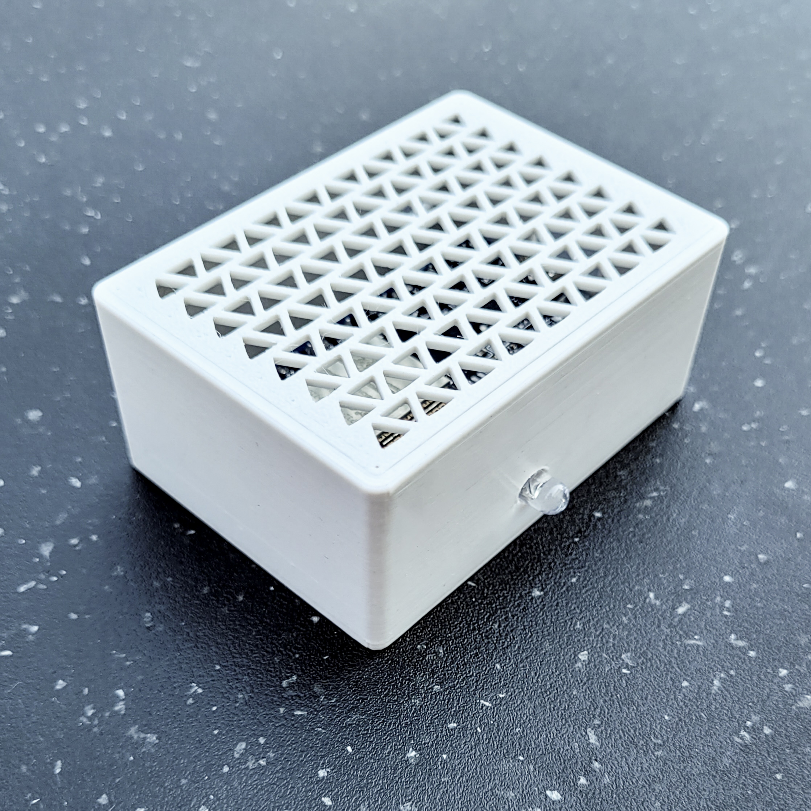
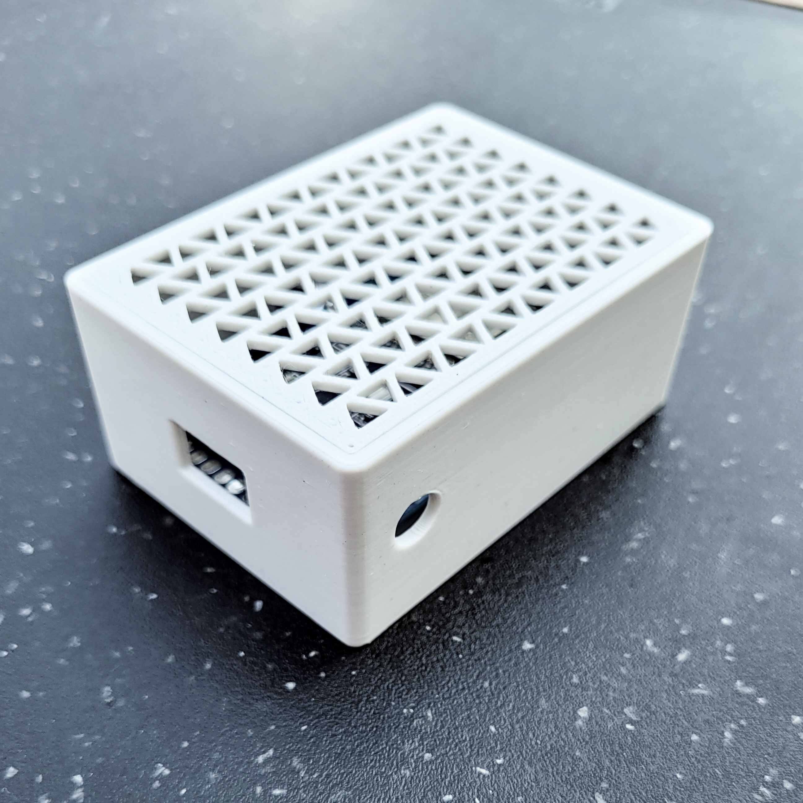
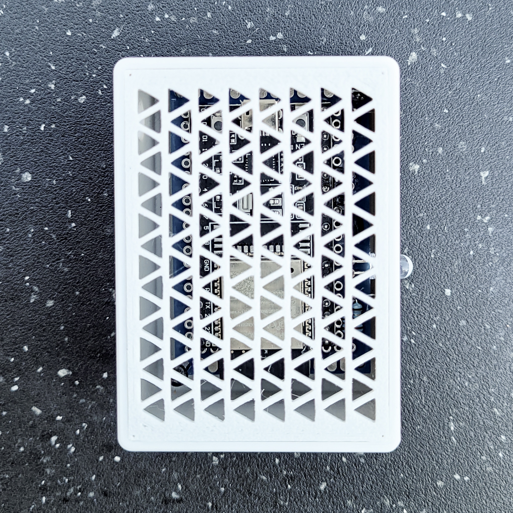
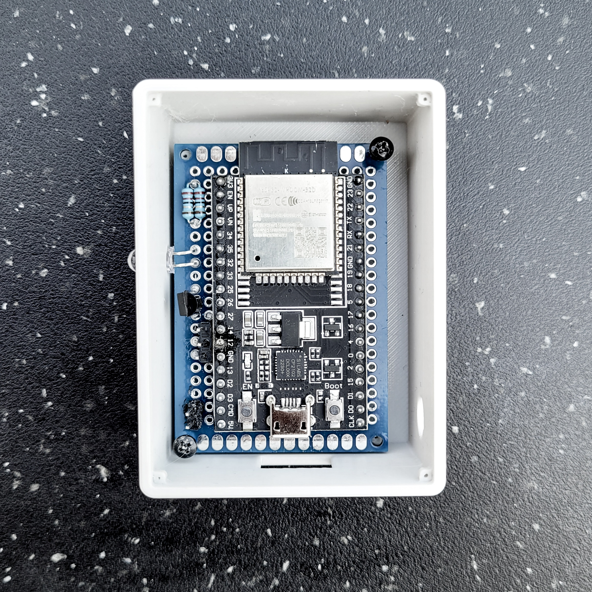

# ESPHome Universal Remote – Hardware

## Contents

- [Parts](#parts)
- [Assembly Options](#assembly-options)
- [Case](#case)

---

## Parts

To build the ESPHome Universal Remote, you’ll need:

- **Resistor**  
  Limits current through the IR LED. In this build: two 22 Ω resistors in parallel (≈11 Ω). Choose a value based on your LED’s specs.

- **IR LED**  
  Emits the infrared signals. Use a 940 nm LED for best compatibility. Narrow beam for focused control, wide for room coverage.

- **NPN Transistor**  
  Used to drive the LED safely, as ESP32 GPIOs can't handle high current directly.

- **IR Receiver**  
  Allows reading commands from existing remotes. These are also available pre-mounted on breakout boards, which often include filtering components, resulting in more reliable readings.

- **ESP32**  
    Any ESP32 model supported by ESPHome can be used, but you may need to adjust the wiring and case design to accommodate differences in pin layout and physical dimensions.

- **(Optional) Pin Headers**  
  Useful for detachable power or signal connections.

---

## Assembly Options

### Breadboard / Perfboard

The circuit can be assembled on a breadboard for prototyping. For a more permanent installation, you can solder the components onto a perfboard or use a custom PCB.  
The images below serve as wiring references, and the included Fritzing file can be viewed or edited as needed.  

Note: These wiring diagrams omit the IR receiver itself and instead show a 3-pin header, which is intended for connecting the receiver module when capturing commands from an existing remote.  
In this configuration the board can either be powered via USB, a 5V DC connection to the 2-Pin header (red wire = 5v, blue wire = GND) or a 3.3V DC connection to the 3-Pin header (orange wire = 3.3v, blue wire = GND). 

  

### Custom PCB

A [PCB design is provided](hardware/PCB) with Gerber files ready for fabrication. The 2-layer layout is simple and affordable to order.

---

## Case

A 3D-printable case is available to protect and mount the remote. It’s optional but recommended for permanent or visible installations.
This case is intended for the use of an ESP32 development board and a 4 x 6 cm (in this case 14 x 20 holes) perf board.
You could reduce the size fo the case if you use an ESP without USB and a smaller perfboard.

### Download 
The case is available in the following formats:
- [Fusion 360 - f3d](hardware/case/f3d)
- [Object File - obj](hardware/case/obj)
- [STEP - stp](hardware/case/stp)

### Pictures

