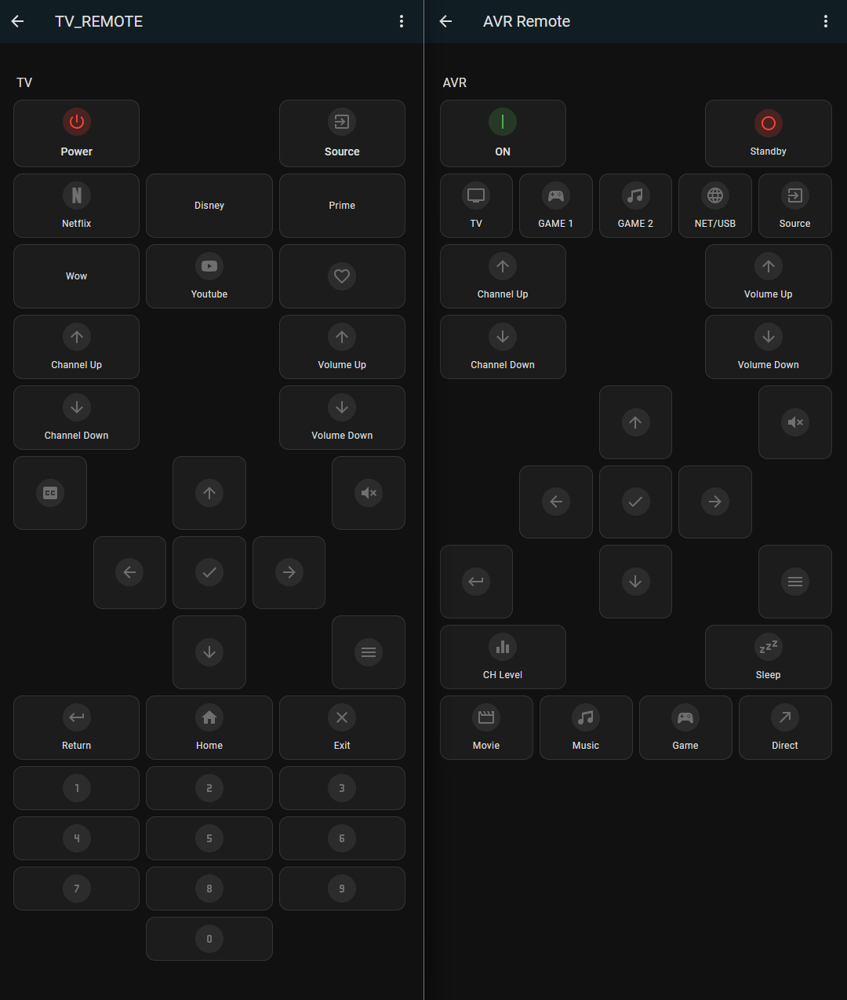

# HassBeam – Setup

## Contents
- [Installation](#installation)
- [Capturing IR Commands](#capturing-ir-commands)
- [Home Assistant Setup](#home-assistant-setup)
  - [Creating Scripts to Send IR Commands](#creating-scripts-to-send-ir-commands)
  - [Creating a Dashboard to Control Devices](#creating-a-dashboard-to-control-devices)

 
 

---

## Installation
Clone or download this repository.

To install the the software on your ESP32, first make sure to configure your Wi-Fi credentials via a `secrets.yaml` file. A sample file is provided in the [esphome folder](esphome) and only needs to be adjusted with your local SSID and password.
after that you can flash the provided configuration file `universalremote.yaml` using [ESPHome](https://esphome.io/).  

While ESPHome can be used directly within Home Assistant, **compilation on limited hardware can be extremely slow**. It's recommended to install and use the ESPHome CLI on a PC for faster builds and flashing. You can find installation instructions in the [ESPHome Getting Started guide](https://esphome.io/guides/getting_started_command_line.html).

#### ESPHome CLI (recommended)
- connect the device via USB (if wifi is already configured you can also use OTA instead of USB)
- open a terminal in the esphome folder 
- run `esphome run .\universalremote.yaml`
- select the proper device
- The code should now be compiled and flashed to the device 

#### ESPHome Dashboard (not recommended for most cases)
- [Physically Connecting to your Device](https://esphome.io/guides/physical_device_connection#physically-connecting-to-your-device)
- [Device Builder](https://esphome.io/guides/getting_started_hassio#device-builder-interface)
- copy the code inside `universalremote.yaml` and flash it to the device

 
 

---

## Capturing IR Commands
### Resources

Many remote control Pronto codes can be found on remotecentral.com

### Accessing the logs
*NOTE: if you decided to use a pin header instead of directly soldering the sensor to the board, you will now have to connect it using jumper wires*
After flashing and starting the device, open the ESPHome logs:
#### ESPHome CLI
- open a terminal in the esphome folder 
- run `esphome logs .\universalremote.yaml`
- if you are on the same network as the esp, select Over The Air (OTA), otherwise connect the device via USB and select the proper device
- you should now be able to see the logs of your device

#### ESPHome Dashboard

- If you are using the ESPHome Dashboard, your device should be listed in the dashboard and you just have to click 'logs'

### Capturing IR-Commands
- Point the remote at the sensor and press the button you want to capture
- The received command should appear in the logs
- Copy the command data of the desired buttons — these will be used later in Home Assistant to replicate the remote’s functionality.

 
 

---
## Sending IR Commands
*Detailed Instructions on how to use the provided services and which protocols are currently supported will be added to this guide soon. In the mean time you can find the current implementation [here](./esphome/hassbeam.yaml) and the documentation of the IR actions [here](https://esphome.io/components/remote_transmitter.html#)*

## Home Assistant Setup

Once the ESP device is connected to your network, it should automatically be discovered by Home Assistant via ESPHome integration. If not, add it manually using its IP address (use the ESPHome integration).

### Creating Scripts to Send IR Commands

To send specific commands to your devices, you’ll need to define **scripts** in Home Assistant. Each script corresponds to a single button or action (e.g., "TV_Power", "AVR_Volume-Up").  
A sample configuration can be found in [`homeassistant/scripts.yaml`](./homeassistant/scripts.yaml). Replace the command data with your captured IR codes or create new scripts.  
you can add these scripts to homeassistant by editing the scripts.yaml file of your homeassistant instance, or by adding it in the UI.  

*Since this part of the setup can be very tedious if you want to add a lot of buttons, a better integration into homeassistant is planned.*

### Creating a Dashboard to Control Devices

You can create a user interface in Home Assistant to trigger these scripts easily. In the example setup, one dashboard page per remote is created (e.g., TV, AVR). The layout uses the [Mushroom](https://github.com/piitaya/lovelace-mushroom) custom cards from HACS for a clean and modern interface.

Example dashboard configurations are provided:
- [`dashboard_tv_example.yaml`](../homeassistant/dashboard_tv_example.yaml)
- [`dashboard_avr_example.yaml`](../homeassistant/dashboard_avr_example.yaml)

These can be imported or used as templates for your own setup.

---
